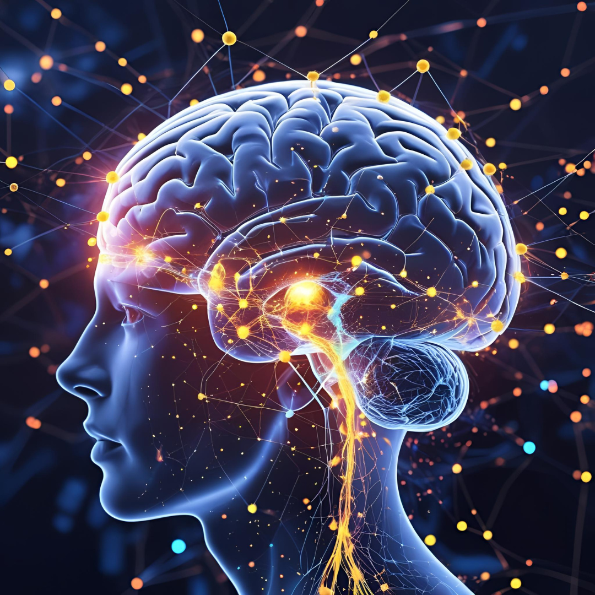

<h1 align="center">
  Brain MRI Analysis with nnU-Net — Tumor & Grey Matter
</h1>

<p align="center">
  
</p>

<p align="center">
 Hadar Shklarnik <br>
 Shir Klinshtern
</p>

<p align="center">
  <a href="https://youtu.be/F57_KVQ65NU" target="_blank">
    
  </a>
</p>

Please list any hyper-parameters as part of the README file!!!!!!!!!!!!!!!!!!!!!

## Table of Contents

- [Project Overview](#project-overview)
- [Repository Structure](#repository-structure)
- [Files In The Repository](#files-in-the-repository)
- [Installation](#installation)
- [Dataset](#dataset)
- [Trained Models](#trained-models)
- [Sources and References](#sources-and-references)
- [License](#license)

## Project Overview
### Medical - TO CHANGE
In this project, we aim to design a robust model for detecting and classifying Alzheimer disease using MRI brain images. The model simulates a radiologist's diagnostic process by classifying images into four severity levels. We evaluate and compare several well-known unsupervised pre-trained models for classification tasks. Then, we train and evaluate these models under adversarial attacks, which can significantly reduce model's performance. By combining the models, we aim to create an ensemble, a unified and robust model that maximizes resilience against adversarial attacks while maintaining high classification performance.

### What is nnU-Net?
nnU-Net (no new U-Net) is an automated deep learning framework for semantic segmentation of medical images (2D & 3D, any modality like MRI, CT, microscopy).
Instead of manually designing a model for each dataset — a process that’s complex, error-prone, and highly dependent on expert skill — nnU-Net:
Analyzes your dataset to create a “dataset fingerprint.”
Automatically configures preprocessing, network architecture, training, and post-processing steps.
Trains the best U-Net variant for your data with minimal input from you.
It’s been tested on 23 biomedical datasets, consistently achieving top leaderboard results, and has become a widely used baseline in segmentation challenges.
Given a dataset, nnU-Net may create 2D U-Net – for 2D and 3D datasets. The pipeline parameters fall into three types:
Fixed – Always used (loss function, main data augmentation, learning rate schedule).
Rule-based – Derived from dataset fingerprint using heuristics (network depth, patch size, batch size).
Empirical – Chosen through trial-and-error (best configuration, post-processing strategy).

The project includes the following steps:

1. **Transfer Learning:** We used transfer learning to fine-tune and extract features from three well-known unsupervised pre-trained models to perform well on our specific task: DINOv2, ResNet34 and EfficientNet-B0.

2. **Adversarial Attacks Implementation:** We performed two adversarial attacks on each one of the models: Fast Gradient Sign Method (FGSM) and Projected Gradient Descent (PGD), which were found to be effective attacks[<sup>[2]</sup>](https://arxiv.org/abs/2303.14133).

4. **Adversarial Training:** To enhance model robustness, we trained these models with adversarial examples, using the PGD attack[<sup>[3]</sup>](https://arxiv.org/abs/1706.06083).A weighted cross-entropy loss combined the standard loss with an adversarial component scaled by the adv_weight parameter. For models that required a different adversarial training approach, we applied Curriculum Adversarial Training[<sup>[4]</sup>](https://arxiv.org/abs/1805.04807).

5. **Ensemble Models:** Finally, we combined these three models using weighted ensemble approach to create a robust model, without affecting performance.

The project is implemented in Python using the PyTorch framework, which allows us to build and train the models efficiently throughout these steps.

## Repository Structure

| Directory Name | Content |
|----------------|---------|
| `assets` | Contains images for each model, including confusion matrices, loss curves, and accuracy curves. |
| `checkpoints` | An empty directory for saving notebook's output: Optuna hyperparameters and trained models. |
| `dataset` | Contains two sub-directories: `raw_dataset` with the original raw data, and `dataset_variables` with processed dataset splitted into train, validation and test sets. |
| `env` | Contains the project environment configuration file and the requirements file. |
| `models` | Contains all model's training notebooks. |
| `utils` | Contains utility flies including `optuna_search.py` for hyperparameter optimization, `utils_funcs.py` with general helper functions, and `Grad_cam.py` for generating Grad-CAM visualizations. |

## Files In The Repository

| File Name | Description |
|-----------|-------------|
| `dataset/prepare_dataset.ipynb` | Notebook used to split the raw dataset into train, validation and test sets and applies a resize transformation of 224x224 pixels. |
| `dataset/dataset_variables/*.pt` | Processed dataset files: `train_set.pt`, `validation_set.pt`, and `test_set.pt` (created by `prepare_dataset.ipynb`). |
| `env/requirements.txt` | List of required Python packages for setting up the environment. |
| `env/project_env.yaml` | Environment configuration file. |
| `utils/optuna_search.py` | Script for performing hyperparameters search using Optuna. It allows customization of epochs, trials and hyperparameters. |
| `utils/Grad_cam.py` | Script for generating Grad-CAM heatmaps. User must specify required parameters as per function definitions. |
| `utils/utils_funcs.py` | Contains general utility functions such as saving models, loading images, displaying graphs, and training. |
| `models/def_models.py` | Definition of class objects used for the trained models. |
| `models/*_model.ipynb` | Model-specific notebook (e.g. `resnet_model.ipynb`). Used for data loading, training, evaluation and results generation: accuracy, confusion matrix, loss curve and accuracy curve. |
| `models/*_model_atk.ipynb` | Adversarial training model-specific notebook (e.g. `resnet_model_atk.ipynb`). Loads a pre-trained model, applies adversarial attacks, and trains the model under these attacks. |


## Installation

#### General Prerequisites

| Library           | Version           |
|-------------------|-------------------|
| `Python`          | `3.10`            |
| `torch`           | `>= 1.4.0`        |
| `matplotlib`      | `>= 3.7.1`        |
| `numpy`           | `>= 1.24.3`       |
| `opencv`          | `>= 4.5.0`        |
| `pandas`          | `>= 1.5.0`        |
| `tqdm`            | `>= 4.65.0`       |
| `scipy`           | `>= 1.8.1`        |
| `seaborn`         | `>= 0.11.2`       |
| `plotly`          | `>= 5.7.0`        |
| `notebook`        | `>= 6.5.4`        |
| `ipywidgets`      | `>= 7.6.0`        |
| `torchmetrics`    | `>= 0.10.0`       |
| `optuna`          | `>= 2.10.0`       |
| `fvcore`          | `>= 0.1.5`        |
| `iopath`          | `>= 0.1.9`        |
| `submitit`        | `>= 1.3.0`        |
| `kornia`          | `>= 0.6.0`        |
| `prettytable`     | `>= 2.4.0`        |
| `pickleshare`     | `>= 0.7.5`        |
| `torchcam`        | `>= 0.1.2`        |
| `torchattacks`    | `>= 0.2.0`        |

#### DINOv2 Specific Requirements

| Library           | Version             |
|-------------------|---------------------|
| `torch`           | `== 2.0.0`           |
| `torchvision`     | `== 0.15.0`          |
| `omegaconf`       | `>= 2.3.0`           |
| `torchmetrics`    | `== 0.10.3`          |
| `fvcore`          | `>= 0.1.6`           |
| `iopath`          | `>= 0.1.9`           |
| `submitit`        | `>= 1.4.5`           |
| `xformers`        | `== 0.0.18`          |
| `cuml-cu11`       | `>= 23.04`           |


To set up the required dependencies, please follow one of the options below:

##### 1. [Conda](https://docs.conda.io/projects/conda/en/latest/user-guide/getting-started.html) (Recommended)
Clone this repository and then create and activate the conda environment (`env/project_env.yaml`) using the following commands:

```
conda env create -f env/project_env.yaml
conda activate project_env
```
##### 2. Pip Install

Clone this repository and then use the provided `env/requirements.txt` file to install the required dependencies:

```
pip install -r env/requirements.txt
```

## Dataset

We used a pre-processed [dataset](https://www.kaggle.com/datasets/lukechugh/best-alzheimer-mri-dataset-99-accuracy) of 11,519 axial MRI brain images: 6,400 images from real patients and 5,119 synthetic images that were developed to rectify the class imbalance of the original dataset. The images are classified into four categories: "Non Demented", "Very Mild Demented", "Mild Demented", and "Moderate Demented". Each category had 100, 70, 28, and 2 patients, respectively, and each patient's brain was sliced into 32 horizontal axial MRIs. The images have a resolution of 128x128 pixels and are in the “.jpg” format. All images have been pre-processed to remove the skull.

The dataset was split according to the train-validation-test methodology: the train set contains 8,192 real and synthetic images, the validation set contains 2,048 real and synthetic images and the test set contains 1,279 real images only. We resized the images into 224x224 pixels to match the input size required for the pre-trained models.

## Trained Models

We provide the files of our trained models, as well as the hyperparameters used for the training. These files can be loaded to the notebooks as mentioned in the next section.

| Model Type                               | Google Drive Link                                                                                | Optuna Params                                                                                |
|------------------------------------------|-------------------------------------------------------------------------------------|---------------------------------------------------------------------------------------------|
| DINOv2                                   | [Download .pth file](https://drive.google.com/file/d/1jABpNVpMTrehBhL6ilm2e0gTx2C7fQyd/view?usp=drive_link)      | [Download JSON file](https://drive.google.com/file/d/1EyuLRh44TgUEpMn5ErN77XdZEmFZ8MNd/view?usp=drive_link) |
| DINOv2 with adversarial attacks          | [Download .pth file](https://drive.google.com/file/d/1kS40XoH3PYkCkNTUJ-Wc3N7iYhHnrPDz/view?usp=drive_link)       | [Download JSON file](https://drive.google.com/file/d/1APagdTEOdTKxP4b-d7ha6dohBSdXZtU0/view?usp=drive_link) | 
| Resnet34                                 | [Download .pth file](https://drive.google.com/file/d/1f4WCkcKVt7FLxv7hUNJgPGbOUJ_4tIoy/view?usp=drive_link)       | [Download JSON file](https://drive.google.com/file/d/1YqA7IwmBaYVneSMh4Gi_RhUTiJxZwbAj/view?usp=drive_link) | 
| Resnet34 with adversarial attacks        | [Download .pth file](https://drive.google.com/file/d/1tDKBQEXTm0mY05oycfMrKSlAINWA8qbD/view?usp=drive_link)       | [Download JSON file](https://drive.google.com/file/d/1cR0OhtmPFjiyqRkifCl4h8s_gSXUGcvE/view?usp=drive_link) | 
| Efficientnet-B0                          | [Download .pth file](https://drive.google.com/file/d/1SuudU3uv2FCtJiD1XKdfpAPaMnk70Qhw/view?usp=drive_link)       | [Download JSON file](https://drive.google.com/file/d/1Bha09qvH3MlP112wm-j9j_NqijC5nPFL/view?usp=drive_link) | 
| Efficientnet-B0 with adversarial attacks | [Download .pth file](https://drive.google.com/file/d/14SlvfDhUDeCw8kxulTuVMP-7FphWQdMJ/view?usp=drive_link)        | [Download JSON file](https://drive.google.com/file/d/1k2nigU0jFDCMz0TbEBUD6cUz_bS2bJFK/view?usp=drive_link) | 

## Sources and References

[1] Madry, A., Makelov, A., Schmidt, L., Tsipras, D., & Vladu, A. (2017). Understanding adversarial attacks on deep learning based medical image analysis systems. [arXiv:1907.10456](https://arxiv.org/abs/1907.10456)

[2] Zhang, H., Li, Y., & Chen, X. (2023). Adversarial Attack and Defense for Medical Image Analysis: Methods and Applications. [arXiv:2308.14597](https://arxiv.org/abs/2308.14597)

[3] Madry, A., Makelov, A., Schmidt, L., Tsipras, D., & Vladu, A. (2018). Towards Deep Learning Models Resistant to Adversarial Attacks. [arXiv:1706.06083](https://arxiv.org/abs/1706.06083)

[4] Cai, Q.-Z., Du, M., Liu, C., & Song, D. (2018). Curriculum Adversarial Training. [arXiv:1805.04807](https://arxiv.org/abs/1805.04807)

[5] Luke Chugh. (2021). Best Alzheimer MRI dataset. Kaggle dataset. [https://www.kaggle.com/datasets/lukechugh/best-alzheimer-mri-dataset-99-accuracy](https://www.kaggle.com/datasets/lukechugh/best-alzheimer-mri-dataset-99-accuracy)

[6] Optuna. (2023). Optuna: A hyperparameter optimization framework. GitHub repository. [https://github.com/optuna/optuna](https://github.com/optuna/optuna)

[7] Facebook Research. (2023). DINOv2. GitHub repository. [https://github.com/facebookresearch/dinov2](https://github.com/facebookresearch/dinov2)

[8] Chen, X., Zhang, H., & Li, Y. (2022). Exploring adversarial attacks and defenses in vision transformers trained with DINO. [arXiv:2206.06761](https://arxiv.org/abs/2206.06761)

[9] Gil, J. (2020). PyTorch Grad-CAM. GitHub repository. [https://github.com/jacobgil/pytorch-grad-cam](https://github.com/jacobgil/pytorch-grad-cam)

[10] Hoki. (2020). Torchattack: PyTorch adversarial attack library. GitHub repository. [https://github.com/Harry24k/torchattacks](https://github.com/Harry24k/torchattacks)

## License

This project is licensed under the MIT License - see the `LICENSE.md` file for details.


## How to get started?
Read these:
- [Installation instructions](documentation/installation_instructions.md)
- [Dataset conversion](documentation/dataset_format.md)
- [Usage instructions](documentation/how_to_use_nnunet.md)

Additional information:
- [Learning from sparse annotations (scribbles, slices)](documentation/ignore_label.md)
- [Region-based training](documentation/region_based_training.md)
- [Manual data splits](documentation/manual_data_splits.md)
- [Pretraining and finetuning](documentation/pretraining_and_finetuning.md)
- [Intensity Normalization in nnU-Net](documentation/explanation_normalization.md)
- [Manually editing nnU-Net configurations](documentation/explanation_plans_files.md)
- [Extending nnU-Net](documentation/extending_nnunet.md)
- [What is different in V2?](documentation/changelog.md)

Competitions:
- [AutoPET II](documentation/competitions/AutoPETII.md)

[//]: # (- [Ignore label]&#40;documentation/ignore_label.md&#41;)
